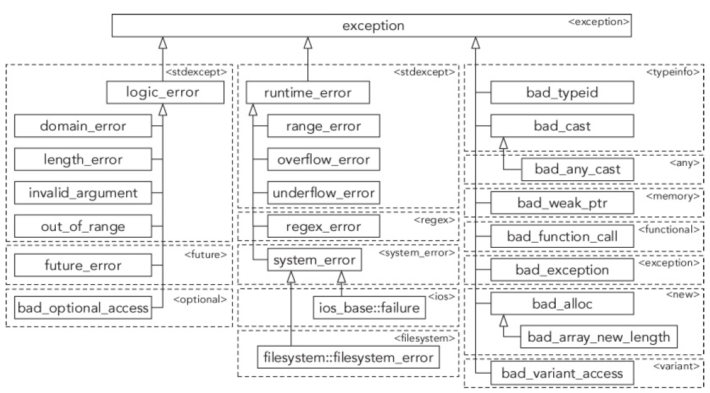

[TOC]

### 0. 原则

- 建议使用对象来抛出异常
- 建议**显式的捕获每种不同的异常类型**，而不是使用`...`来获取异常
- 建议**按const引用捕获异常**，可**避免按值传递**捕获异常时可能出现的**对象截断**。
- 抛出异常后，异常按照**catch在代码中出现的顺序**进行查找，直到被对应的catch捕获。
- **捕获并处理程序中所有可能抛出的异常！！！！** ，如果抛出了异常但没处理程序会终止。
- 使用存在继承关系的对象捕获异常时，**一定按引用捕获**。**按值**捕获**可能**会发生**截断**。
- 异常类的层次越高，异常越不具有针对性。所以catch应当把层次低的对象放前面（详见2）
- **建议自己的异常类直接或者间接继承`exception`类**。
- 嵌套异常直接捕获的异常类型是**最后一次的类型**。


### 1. 异常

#### 1.1 异常类型

`throw`可以**抛出任何类型的异常**，如果没有指定抛出的对象，那么`throw`**抛出最近出现的异常**

```c++
void func(int a) {
    if (a < 10) throw -1;
    else throw "Hello";
}

int main() {
    int a = 10;

    try {
        func(a);
    } catch (const int e) {
        cout << "Hello world!" << endl;
    } catch (const char* e) {
        cout << e << endl;
    }

    return 0;  //结果：Hello
}
```

建议**使用对象**作为异常抛出，好处是：

- 对象的类名可以传递信息
- 对象可以储存信息，包括描述异常的字符串

```c++
void func(int a) {
    if (a < 10) throw runtime_error("123");
    else throw exception();
}

int main() {
    int a = 10;

    try {
        func(a);
    } catch (const runtime_error &e) {   //内置的runtime_error对象
        cout << e.what() << endl;
    } catch (const char *e) {
        cout << e << endl;
    } catch (...) {   
        cout << "Hello world!" << endl;  
    }

    return 0;   //输出Hello world!
}
```


#### 1.2 未捕获的异常：建议显式的捕获所有可能的异常

如果**代码中抛出了异常**，而**没有相应的catch捕获**到的话，**编译器会调用内建的`terminate()`**『该函数调用了<cstdlib>中的abort()』函数**终止程序**。

```c++
void func(int a) {
    if (a < 10) throw runtime_error("123");
    else throw exception();
}

int main() {
    int a = 5;

    try {
        func(a);
    } catch (const int &e) {
        cerr << "Hello world!" << endl;
    } 
    
    cout << "I love you bady!" << endl;   //这一句没有输出，前面try中的异常没有被后卖弄catch捕获到，程序终止

    return 0;    
}
/*以下为输出信息*/
terminate called after throwing an instance of 'std::runtime_error'
  what():  123
Process finished with exit code 134
```

当代码中有未捕获的异常时，我们可以**调用自己指定的回调函数**而不是使用内置的`terminate()`函数

**过程**：使用`set_terminate`为`terminate_handler`设置函数指针，调用`terminate_handler`指向的函数

```c++
void func(int a) {
    if (a < 10) throw runtime_error("123");
    else throw exception();
}

void test() {
    cerr << "My function!" << endl;
    exit(1);
}

int main() {
    set_terminate(test);   //设置自己的函数为异常没有被捕获到的时候的处理函数

    try {
        func(5);
    } catch (const int &e) {
        cerr << "Hello world!" << endl;
    }

    cout << "I love you bady!" << endl;

    return 0;
}
/*以下为输出*/
My function!

Process finished with exit code 1
```

设置自己的回调函数的**过程可以解释为**：如果`main()`产生了未处理的异常，**检查`terminate_handler`，如果指定了`terminate_handler`，则执行；未指定，则运行默认的`terminate()`函数** 

```c++
try {
	main(argc, argv); 
} catch (...) {
	if (terminate_handler != nullptr) {
		terminate_handler();
	} else {
		terminate();
	}
} 
```


#### 1.3 noexcept

用noexcept修饰的函数，如果产生了异常，c++将调用`terminate()`函数终止程序。

在派生类重写虚方法，可以把重写的虚方法标记为noexcept

移动构造函数和移动赋值函数必须使用noexcept修饰

析构函数必须使用noexcept修饰（编译器已经隐式的修饰了）


### 2. 异常与多态

c++提供了一部分异常类：可以使用`.what()`方法返回字符串



**父类可以捕获子类的异常**：

```c++
try {
    throw runtime_error("Hello world!");
} catch (const exception &e) {
    cout << "Father: " << e.what() << endl;   //结果输出：Father: Hello world!
} catch (const runtime_error &r) {
    cout << "Son: " << r.what() << endl;
}
```

建议将**最多限制的匹配（catch）放在前面，最小限制的匹配（catch）放在后面**（比如子类放在前，父类放在后，因为继承中类的层次越高，越不具有针对性）

```c++
try {
    throw runtime_error("Hello world!");
} catch (const runtime_error &r) {
    cout << "Son: " << r.what() << endl;
} catch (const exception &e) {
    cout << "Father: " << e.what() << endl;
} catch (...) {
    cout << "error\n";
}
//每个catch的范围越来越大
```

#### 2.1编写自己的异常类

**建议自己的异常类直接或者间接继承`exception`类**。

**好处**：

- 自己的异常类可以使用更有意义的类名。比如： SunError
- 可以在异常中加入自己的信息；而**标准的异常类只允许设置字符串**。

例如，下面编写了文件读取异常以及子类异常

```c++
class FileError : public exception {
public:
    explicit FileError(string_view fileName) : mFileName(fileName) {}
    [[nodiscard]] const char *what() const noexcept override { return mMessage.c_str(); }
    [[nodiscard]] string_view getFileName() const noexcept { return mFileName; }
protected:
    void setMessage(string_view message) { mMessage = message; }
private:
    string mFileName, mMessage;
};

class FileOpenError : public FileError {
public:
    explicit FileOpenError(string_view fileName) : FileError(fileName) {
        setMessage("Unable to open "s + fileName.data());
    }
};

class FileReadError : public FileError {
public:
    FileReadError(string_view fileName, size_t lineNumber)
            : FileError(fileName), mLineNumber(lineNumber) {
        ostringstream ostr;
        ostr << "Error reading " << fileName << " at line " << lineNumber;
        setMessage(ostr.str());
    }
    [[nodiscard]] size_t getLineNumber() const noexcept { return mLineNumber; }
private:
    size_t mLineNumber;
};

/*在函数中使用异常*/
vector<int> readIntegerFile(string_view fileName) {
    ifstream inputStream(fileName.data());
    if (inputStream.fail()) {
        // We failed to open the file: throw an exception
        throw FileOpenError(fileName);
    }
    vector<int> integers;
    size_t lineNumber = 0;
    while (!inputStream.eof()) {
        // Read one line from the file
        string line;
        getline(inputStream, line);
        ++lineNumber;
        // Create a string stream out of the line
        istringstream lineStream(line);
        // Read the integers one-by-one and add them to a vector
        int temp;
        while (lineStream >> temp) {
            integers.push_back(temp);
        }
        if (!lineStream.eof()) {
            // We did not reach the end of the string stream.
            // This means that some error occurred while reading this line.
            // Throw an exception.
            throw FileReadError(fileName, lineNumber);
        }
    }
    return integers;
}
```

### 3.嵌套异常

**抛出新的异常之后，前面的异常信息会丢失**。如果不想前面的异常丢失，可以使用**嵌套异常**。

嵌套异常能直接捕获的是最外层的异常。

使用`dynamic_cast()`和`nested_exception`的`rethrow_nested()`访问被嵌套的异常，如下：

```c++
class MyException : public std::exception {
public:
    explicit MyException(string_view message) : mMessage(message) {}
    [[nodiscard]] const char *what() const noexcept override { return mMessage.c_str(); }
private:
    string mMessage;
};

void dosomething() {
    try {
        throw runtime_error("Throwing a runtime_error exception");
    } catch (const runtime_error &e) {
        cout << __func__ << " caught a runtime_error" << endl;
        cout << __func__ << " throwing MyException" << endl;
        throw_with_nested(MyException("MyException with nested runtime_error"));
    }
}

int main() {
    try {
        dosomething();
    }catch(const runtime_error&e){   //没有在这里被捕获
        cout << e.what() << endl;
    }catch (const MyException &e) {  //捕获最外层的异常
        cout << __func__ << " caught MyException: " << e.what() << endl;
        const auto *pNested = dynamic_cast<const nested_exception *>(&e);
        if (pNested) {  //如果不是嵌套异常，则pNested为空指针
            try {
                pNested->rethrow_nested();   //使用该方法重新抛出被嵌套的异常
            } catch (const runtime_error &e) {
                // Handle nested exception
                cout << " Nested exception: " << e.what() << endl;
            }
        }
    }

    return 0;
}
```

可以**使用`rethrow_if_nested()`**代替`dynamic_cast()`和`nested_exception`的`rethrow_nested()`，实际就是个简单的封装

```c++
int main() {
    try {
        dosomething();
    }catch(const runtime_error&e){
        cout << e.what() << endl;
    }catch (const MyException &e) {
        cout << __func__ << " caught MyException: " << e.what() << endl;
        try {
            rethrow_if_nested(e);
        } catch (const runtime_error& e) {
            cout << " Nested exception: " << e.what() << endl;
        }
    }

    return 0;
}
```


### 3. 重新抛出异常

c++高级编程 14.4 p306-307

使用`throw`重抛异常，不能使用`throw e重`抛异常

```c++
void g() { throw invalid_argument("Some exception"); }
void f() {
	try {
		g();
	} catch (const exception& e) {
		cout << "caught in f: " << e.what() << endl;
		throw; // rethrow
	}
}
int main() {
	try {
		f();
	} catch (const invalid_argument& e) {
		cout << "invalid_argument caught in main: " << e.what() << endl;
	} catch (const exception& e) {
		cout << "exception caught in main: " << e.what() << endl;
	}
	return 0;
}
/*以下为输出*/
caught in f: Some exception
invalid_argument caught in main: Some exception
//如果把throw换成throw e，输出结果变成
caught in f: Some exception
exception caught in main: Some exception  //原因是因为invalid_argument是从exception派生来的，"throw e"会引发截断操作，使得invalid_argument缩减为exception
```


### 4. 异常和内存泄漏

异常和指针一起使用时容易造成**内存泄漏**。使用时**要注意**或者**使用智能指针**

```c++
try {
    auto arr = new int[10]();
    throw 1;     //抛出异常，跳到catch，delete语句没有执行，内存泄漏
    delete[]arr;
} catch (const int &e) {
    cerr << "Hello world!" << endl;
}
```


### 5. 常见错误 p309-314

#### 5.1 内存错误

使用`new\new[]`申请内存失败，会抛出`bad_alloc`类型的异常。再**分配大内存**时，可以考虑使用`try/catch`。

```c++
int* ptr = nullptr;
size_t integerCount = numeric_limits<size_t>::max();
try {
	ptr = new int[integerCount];
} catch (const bad_alloc& e) {
	cerr << __FILE__ << "(" << __LINE__ << "): Unable to allocate memory: " << e.what() << endl;  //__FILE__输出当前文件名；__LINE__输出行数
	// Handle memory allocation failure.
	return;
} 
// Proceed with function that assumes memory has been allocated.
```

指定new不抛出异常。**使用`new(nothrow)`**

```c++
int* ptr = new(nothrow) int[integerCount];
if (ptr == nullptr) {
	cerr << __FILE__ << "(" << __LINE__ << "): Unable to allocate memory!" << endl;
	// Handle memory allocation failure.
	return;
} 
// Proceed with function that assumes memory has been allocated.
```

自己指定内存分配失败后的行为  **详看p310**。可以**指定new handler**，这时候分配内存失败**不会抛出异常而是会执行new handler函数**。new handler是一个没有参数、返回值的函数。

```c++
class please_terminate_me : public bad_alloc { };
void myNewHandler() {
	cerr << "Unable to allocate memory." << endl;
	throw please_terminate_me();
}

int main() {
	try {
		// Set the new new_handler and save the old one.
		new_handler oldHandler = set_new_handler(myNewHandler);
		// Generate allocation error
		size_t numInts = numeric_limits<size_t>::max();//这一句只是为了获取一个大数
    	int* ptr = new int[numInts];
		// Reset the old new_handler
		set_new_handler(oldHandler);
	} catch (const please_terminate_me&) {
		cerr << __FILE__ << "(" << __LINE__ << "): Terminating program." << endl;
		return 1;
	}
	return 0;
}
```


#### 5.2 构造函数异常

通常是指构造函数中申请内存造成的异常。

**一旦构造函数抛出异常，析构函数就不会执行。**抛出异常时**必须手动将内存释放**。

```c++
template <typename T>
Matrix<T>::Matrix(size_t width, size_t height) {
	mMatrix = new T*[width] {}; // Array is zero-initialized!
	// Don't initialize the mWidth and mHeight members in the ctor-initializer. These should only be initialized when the above mMatrix allocation succeeds!
	mWidth = width;
	mHeight = height;
	try {
		for (size_t i = 0; i < width; ++i) {
			mMatrix[i] = new T[height];
		}
	} catch (...) {
		cerr << "Exception caught in constructor, cleaning up..." << endl;
    	cleanup();   //手动释放内存
		// Nest any caught exception inside a bad_alloc exception.
		std::throw_with_nested(std::bad_alloc());
	}
}
/*析构*/
template <typename T>
Matrix<T>::~Matrix() {
	cleanup();
}
/**/
template <typename T>
void Matrix<T>::cleanup() {
	for (size_t i = 0; i < mWidth; ++i)
		delete[] mMatrix[i];
	delete[] mMatrix;
	mMatrix = nullptr;
	mWidth = mHeight = 0;
}
```


#### 5.3 构造函数的初始化列表异常: function-try-blocks

有很多限制(p313)，很少使用，**尽可能避免使用，除非涉及到裸指针才有必要使用**

```c++
class SubObject {
public:
	SubObject(int i);
};
SubObject::SubObject(int i) {
	throw std::runtime_error("Exception by SubObject ctor");
}

class MyClass {
public:
	MyClass();
private:
	int* mData = nullptr;
	SubObject mSubObject;
};

MyClass::MyClass()
try
: mData(new int[42]{ 1, 2, 3 }), mSubObject(42) {  //function-try-blocks这么写
	/* ... constructor body ... */
} catch (const std::exception& e) {
	// Cleanup memory.
	delete[] mData;
	mData = nullptr;
	cout << "function-try-block caught: '" << e.what() << "'" << endl;
}
```


#### 5.4 析构函数异常

**析构函数不能抛出任何异常，被隐式标记为noexcept**。原因：p314

如果带noexcept的析构函数抛出异常，会直接调用terminate()函数(任何noexcept修饰的函数都会)

可以**手动对析构函数标明`noexcept(false)`**。或者**类具有子对象，而子对象的析构函数使用`noexcept(false)`标记**。

