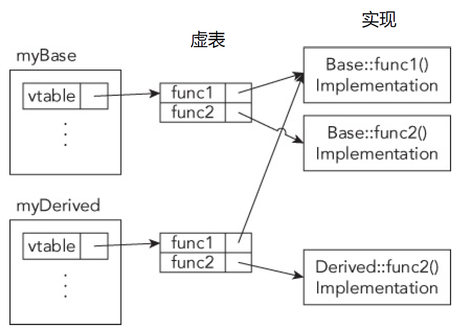

[TOC]

# 继承  c++高级编程第10章

## 0. 总体说明

1. 一个类可以有多个派生类，派生类也可以有自己的派生类

2. 如图所示，当**创建一个派生类**的时候，**会创建基类的所有成员**，但是**派生类只能访问基类的public和protected成员，private被创建了但不能访问**。

   <font color=red>没补图</font>  

3. 继承的运行方式是单向的：**派生类可以访问基类，基类不能知道有关派生类的信息。** 

```c++
class Father {
public:
    int b = 10;
};
class Son : private Father {
public:
    void print() {
        cout << b << endl;
    }
};

Son s{};
s.print();  //10
```

4. 在基类中使用virtual关键字修饰的函数，在派生类中可以重写。<font color=red>详见</font> 1.2 **virtual关键字**

5. 

   1. 可以使用**基类创建其派生类的引用和指针**，这些引用和指针**可以使用基类的成员，但不能使用派生类的成员**。

      **原因**：根据参考2，在创建派生类对象时创建了基类所有的成员。这时候创建基类的指针指向该派生类，实际上指向了创建该派生类时的基类成员，并屏蔽了属于派生类但不属于基类的成员。

      ```c++
      class Father {
      public:
          int fa=10;
      };
      
      class Son : public Father {
      public:
          int sa=10;
      };
      
      Son son{};
      Father &f1 = son;  
      cout<<f1.fa<<endl; //10
      //cout<<f1.sa<<endl;  //出错
      
      Father *f2 = &son;
      cout<<f2->fa<<endl; //10
      //cout<<f2->sa<<endl;  //出错
      ```

   2. 当**调用的是虚方法时，会调用其派生类的实现**。

      **原因**：根据参考2，创建派生类时会创建所有基类的成员。<font color=red>留一下</font> 
      
      ```c++
      class Father {
      public:
          virtual void vprint() {
              cout << "vfather" << endl;
          };
      };
      
      class Son : public Father {
      public:
          void vprint() override {
              cout << "vson" << endl;
          };
      };
      
      Son son{};
      Father &f1 = son;  
      f1.vprint();   //vson，使用的是派生类中重写的方法
      
      Father *f2 = &son;
      f2->vprint();  //vson，使用的是派生类中重写的方法
      ```
      

6. override在声明时修饰，在定义时不需要。


## 0. 总体建议

1. **建议类所有的函数(除了构造函数，包括析构函数)都使用virtual关键字修饰**。原因：可以防止其派生类重写的时候因为没有virtual声明而变成自己的独立函数。对于virtual，对象要开辟额外的空间存放虚函数的指针，但是在现代计算机中，这点内存占用可以忽略不计。

2. **如果要创建大量的类对象，就只对要重写的方法使用virtual。**原因：比如创建了几百万个对象，这时候虚表的内存就不能忽略不计了。

3. 建议**析构函数一定**要用**virtual声明**。**原因**：如果析构函数没有被声明virtual，**很容易在销毁对象时不释放内存！！！！！！！！！！！！！**

   ```c++
   class Base {
   public:
       Base() = default;
       //~Base() = default;
       virtual ~Base() = default; //析构函数用virtual修饰
   };
   
   class Derived : public Base {
   public:
       Derived() {
           mString = new char[30];
           cout << "mString allocated" << endl;
       }
   
       //~Derived() {
       ~Derived() override {
           delete[] mString;
           cout << "mString deallocated" << endl;
       }
   
   private:
       char *mString;
   };
   
   int main() {
       Base *ptr = new Derived(); 
       delete ptr;  //如果基类的析构函数不用virtual修饰，那么会调用基类的析构函数（c++标准没有定义这种行为，大部分编译器会调用基类的析构函数），此时会造成内存泄漏
       return 0;
   }
   
   ```

4. 建议数据成员都声明为private，使用set/get来设置和获取它们，set中可以设置类型检查。

5. 在派生类中**重写的方法**，**总是使用override修饰**。**原因**：详见override关键字部分


## 1. 使用到的关键字

### 1.1 final

- 使用final修饰的类不允许被继承

  ```c++
  class Father final{
  	/*do something*/
  };
  
  class Son : public Father {   //编译器报错，Father被final修饰，不允许被继承
  	/*do something*/
  };
  ```

- 使用final修饰的类方法不允许被重写

  ```c++
  class Father {
  public:
      virtual void test() final{   //final修饰的成员方法
          cout<<"hello world!"<<endl;
      };
  };
  
  class Son : public Father {
  public:
      void test(){};  //编译器报错，倍final修饰的方法无法被重写
  };
  ```

### 1.2 virtual

基类中使用virtual修饰的方法，可以在派生类中重写。

1. **建议类所有的函数(除了构造函数，包括析构函数)都使用virtual关键字修饰**。编译器默认生成的构造函数没有用virtual修饰。构造函数不需要也无法被声明virtual，因为创建对象时，需要明确的指定类。

2. **在基类中用virtual声明的方法，在派生类中会隐氏的使用virtual，即virtual会一直是virtual**。

   ```c++
   /*father*/
   class Father {
   public:
       virtual void vprint() {
           cout << "vfather" << endl;
       };
   };
   
   /*son*/
   class Son : public Father {
   public:
       void vprint() override;
   };
   
   void Son::vprint() {
       cout << "vson" << endl;
   };
   
   /*grandson*/
   class Grandson : public Son {
   public:
       void vprint() override;
   };
   
   void Grandson::vprint() {
       cout << "vgrandson" << endl;
   }
   
   /*main*/
   Son son{};
   Father &f1 = son;
   f1.vprint();   //vson
   
   Grandson gson{};
   Father &fg1 = gson;
   fg1.vprint();   //vgrandson
   ```

3. 如果基类中的方法没有使用virtual修饰，那么其派生类中即使有跟基类同名的方法，两个方法之间没有任何关系，不能看作虚函数的重写。

   ```c++
   /*father*/
   class Father {
   public:
       void vprint() {                   //没有使用virtual修饰
           cout << "vfather" << endl;
       };
   };
   
   /*son*/
   class Son : public Father {
   public:
       void vprint() {             //派生类自己独立的函数，跟父类的同名函数没有任何关系
       	cout << "vson" << endl;
   	};
   };
   
   Son son{};
   Father *fa = &son;
   fa->vprint();   //vfather  调用了父类的方法
   ```

4. **virtual关键字的实现**：

   1. 当一个类**有用virtual声明的方法**时，编译器会给这个类**创建一个虚表**。派生类，**也会被创建虚表**。创建了虚表的类会有一个指向它的虚表的指针。

   2. **虚表存放虚函数的函数指针，非虚方法不存放在虚表。**当派生类被创建时，**派生类的虚表**包含其**基类所有虚方法的函数指针**。当基类的虚方法**没有被重写**时，函数指针**指向基类中虚方法的定义**；当基类的虚方法**被重写**时，函数指针**指向派生类中被重写的虚方法的定义**。如下面的例子：

      ```c++
      class myBase{
      public:
          virtual void func1(){};
          virtual void func2(){};
          void nonVirtualFunc(){};
      }
      
      class myDerived{
      public:
          void func2()override {};
          void nonVirtualFunc(){};  //独立函数，跟基类的同名函数无关，所以虚表中没有
      }
      ```

      他们的虚表如图所示：

      


### 1.3 override

修饰派生类重写的方法。被重写的方法必须与基类方法一致，不然会报错

**例如**：

最开始的时候：

```c++
class Father {
public:
    virtual void test(int a) {
        cout << a << endl;
    }
};

class Son : public Father {
    void test(int a) override {    //重写了Father的test方法
        cout << "Hello world!" << endl;
    }
};
```

此时假设因为某个原因需要修改基类的test函数，其派生类的相关方法也需要更新，override可以帮我们找到这些方法，而不需要我们一个个自己去找。

```c++
class Father {
public:
    //virtual void test(int a) {
    virtual void test(const string &a) {   //int 更改为const string
        cout << a << endl;
    }
};

class Son : public Father {
    void test(int a) override {    //此时被override的函数如果跟基类的函数不一致，编译器会报错
        cout << "Hello world!" << endl;
    }
};
```

如果没有被override修饰，那么在基类的方法被修改后，派生类重写的方法会被看作自己的方法，因为无法在基类中找到相同的函数

```c++
class Father {
public:
    //virtual void test(int a) {
    virtual void test(const string &a) {   //int 更改为const string
        cout << a << endl;
    }
};

class Son : public Father {
    void test(int a)  {    //基类函数修改之前，这个函数被看作基类虚函数的重写(虽然没有被override修饰)。基类函数修改之后，这个函数变成了子类自己的方法，与基类无关，因为基类中没有名为void test(int a) 的虚函数
        cout << "Hello world!" << endl;
    }
};
```

