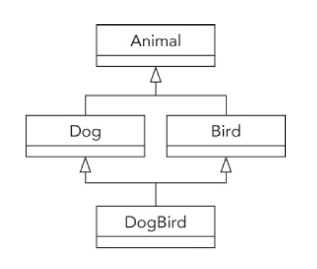
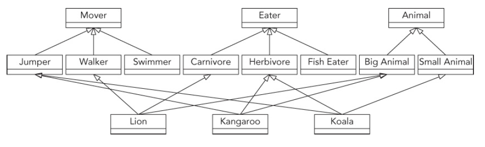

[TOC]

c++高级编程第10章5节

### 0. 概述

多继承通常可以避免使用。

### 1.多重继承构造函数的顺序

**构造函数**按照定义中**父类列出的顺序**执行；**析构函数则相反**。

```c++
class Base1 {
public:
    Base1() { cout << "Base1" << endl; };
};

class Base2 {
public:
    Base2() { cout << "Base2" << endl; };
};

class Son : public Base2, public Base1 {  //先声明Base1再声明Base2
public:
    Son() { cout << "Son" << endl; }
};

Son son{};  //输出Base2 Base1 Son
```


### 2. 命名歧义

#### 2.1 歧义的产生

**父类中有相同命名的方法或者数据成员**

```c++
class Base1 {
public:
    Base1() { cout << "Base1" << endl; };
    virtual void test() { cout << "Base1 test\n"; }
    int data = 10;
};

class Base2 {
public:
    Base2() { cout << "Base2" << endl; };
    virtual void test() { cout << "Base2 test\n"; }
    int data = 20;
};

class Son : public Base2, public Base1 {
public:
    Son() { cout << "Son" << endl; }
    //void test() override { cout << "Son test\n"; };
};
int main(){
    Son son{};
	//son.test();   //编译器报错，不知道执行两个父类中哪一个test() 函数
	//cout << s.data << endl;  //编译器报错，不知道输出两个父类中哪一个data
    return 0;
}
```

#### 2.2 消除办法

0. 直接指定调用哪个类的方法。没有改变类本身

   ```c++
   int main() {
       Son son{};
       son.Base2::test();  //output Base2 test
       return 0;
   }
   ```

1. **使用`dynamic_cast()`显式的将对象上转型**（本质是向编译器隐藏多余的方法版本）来消除歧义。**没有修改类本身**，而是对类对象进行了强制类型转换。

   ```c++
   int main(){
       Son son{};
   	//son.test();   //编译器报错，不知道执行两个父类中哪一个test() 函数
   	//cout << s.data << endl;  //编译器报错，不知道输出两个父类中哪一个data
       dynamic_cast<Base1 &>(son).test();  //output: Base1 test
       dynamic_cast<Base2 &>(son).test();  //output: Base2 test
       return 0;
   }
   ```

2. 在子类中重新定义冲突方法，实际上执行了子类的方法

   ```c++
   class Son : public Base2, public Base1 {
   public:
       Son() { cout << "Son" << endl; }
       void test() override { 
           cout << "Son test\n"; 
           //Base1::test(); //可以这样来使用父类冲突的方法
       };
   };
   
   int main(){
       Son son{};
   	son.test();   //output: Son test
   	//cout << s.data << endl;  //编译器报错，不知道输出两个父类中哪一个data
       return 0;
   }
   ```

3. **使用`using`显式的指定**

   ```c++
   class Son : public Base2, public Base1 {
   public:
       using Base1::test;     //指定使用Base1的test函数
       Son() { cout << "Son" << endl; }
   };
   
   int main(){
       Son son{};
       son.test();  //output: Base1 test
       return 0;
   }
   ```


### 3. 多次继承同一基类

比如，编译器会报错

```c++
class Dog {};
class Bird : public Dog {};
class DogBird : public Bird, public Dog {}; // Error!
```

但是，c++允许下面的继承结构



在这种继承结构中，**最好的方法**是将**最顶部的类**设置为没有功能的类

```c++
class Animal {
public:
    virtual void eat() = 0;
};

class Dog : public Animal {
public:
    virtual void bark() { cout << "Woof!" << endl; }
    void eat() override {cout << "The dog ate." << endl;}
};

class Bird : public Animal {
public:
    virtual void chirp() { cout << "Chirp!" << endl; }
    void eat() override {cout << "The bird ate." <<endl;}
};

class DogBird : public Dog, public Bird {
public:
    using Dog::eat;
};
```

但希望父类有自己的功能时，可以使用**虚基类**：

```c++
class Animal {
public:
    virtual void eat() = 0;
    virtual void sleep() { cout << "zzzzz...." << endl; }
};

class Dog : public virtual Animal {   //虚基类
public:
    virtual void bark() { cout << "Woof!" << endl; }
    void eat() override { cout << "The dog ate." << endl; }
};

class Bird : public virtual Animal {
public:
    virtual void chirp() { cout << "Chirp!" << endl; }
    void eat() override { cout << "The bird ate." << endl; }
};

class DogBird : public Dog, public Bird {
public:
    void eat() override { Dog::eat(); }
};

int main() {
    DogBird myConfusedAnimal;
    myConfusedAnimal.sleep(); //如果不使用虚基类，会报错
    return 0;
}
```


### 4. 多重继承的应用

- 实现**混入类**。（混入类就是在程序设计时，一部分派生类可能需要某个功能，就可以把这些功能编入一个类，使需要这些功能的子类继承新编写的类）
- 用来模拟基于组件的类。例如

 