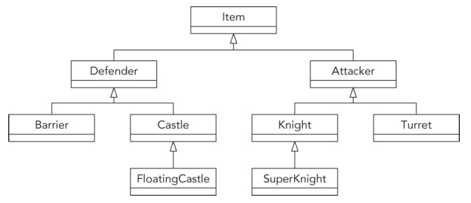
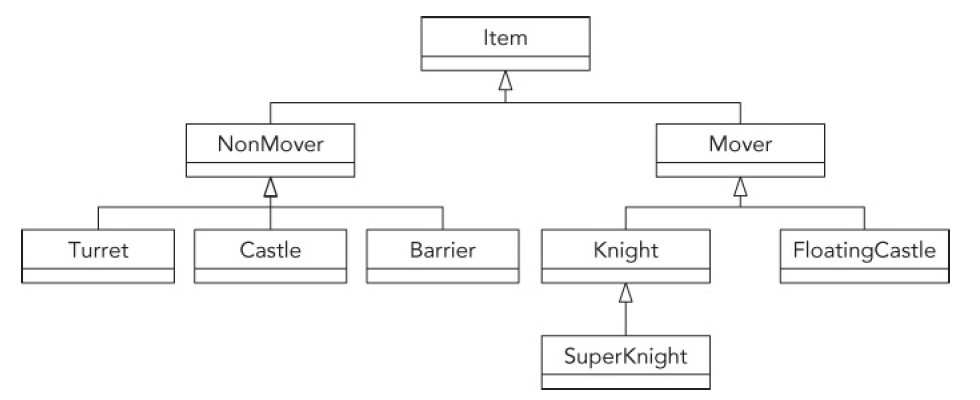
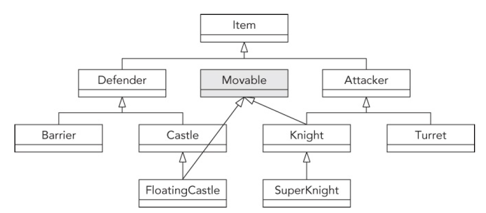

[TOC]

### 0. 概述

- **抽象类**常用作类层次结构的顶层。
- 抽象类的子类如果想能够实例化，**必须实现从父类继承的所有纯虚方法**。

### 1.抽象类

**含有纯虚方法的类叫做<font color=red>抽象类</font>。抽象类不能被实例化。**

```c++
class Father {
public:
    Father() = default;
    virtual ~Father() = default;
    virtual void test() = 0;     //纯虚方法,该类为抽象类
    static void print() { cout << "Hello world!" << endl; };
    //void print() { cout << "Hello world!" << endl; };  //不能被实例化，所以非虚/静态成员函数没有意义
};

int main{
    //Father father{}; //编译器报错，抽象类不能被实例化
    Father::print();  //output: Hello world!
    return 0;
}
```

**纯虚方法**：`=0`表示，当前类不需要实现，可在其派生类实现。

```c++
virtual void test() = 0;     //纯虚方法
```

**可以通过派生类实例化** ：派生类要实现父类的全部纯虚函数才能实例化

```c++
class Father {
public:
    Father() = default;
    virtual ~Father() = default;
    virtual void test() = 0;
    static void print() { cout << "Hello world!" << endl; };
};

class Son : public Father {
public:
    void test() override { cout << "Son test" << endl; }
};

int main() {
    Father::print();
    Father *father = new Son{};
    father->test();  //output: Son test
    return 0;
}
```

### 2. 混入类

混入类只是种叫法，**技术基础是多重继承**。在程序设计时，假设我们设计的某些类需要用到每一类的方法，我们可以把这些方法封装到一起形成类。使需要这些方法的类继承这些方法类，这样这些方法类就叫做混入类。

混入类**可以避免后续添加新功能时重新设计类的结构层次**。

混入类命名**一般以`able`结尾**。


例如，原设计是：



如果不加入混入类，需要更改结构层次：

 

加入混入类：其中Knight和FloatingCastle类继承了新的Movable类。

 

### 3. 虚基类 [参考](http://c.biancheng.net/cpp/biancheng/view/238.html) 

虚继承的目的是让某个类做出声明，承诺愿意共享它的基类。其中，这个被共享的基类就称为虚基类（Virtual Base Class）。在这种机制下，不论虚基类在继承体系中出现了多少次，在派生类中都只包含一份虚基类的成员。

**当希望基类有自己的功能时，可以使用虚基类**

使用虚基类可以有效避免歧义

```c++
class Animal {
public:
    virtual void eat() = 0;
    virtual void sleep() { cout << "zzzzz...." << endl; }
};

class Dog : public virtual Animal {
public:
    virtual void bark() { cout << "Woof!" << endl; }
    void eat() override { cout << "The dog ate." << endl; }
};

class Bird : public virtual Animal {
public:
    virtual void chirp() { cout << "Chirp!" << endl; }
    void eat() override { cout << "The bird ate." << endl; }
};

class DogBird : public Dog, public Bird {
public:
    void eat() override { Dog::eat(); }
};

int main() {
    DogBird myConfusedAnimal;
    myConfusedAnimal.sleep(); // 可以执行
    return 0;
}
```

